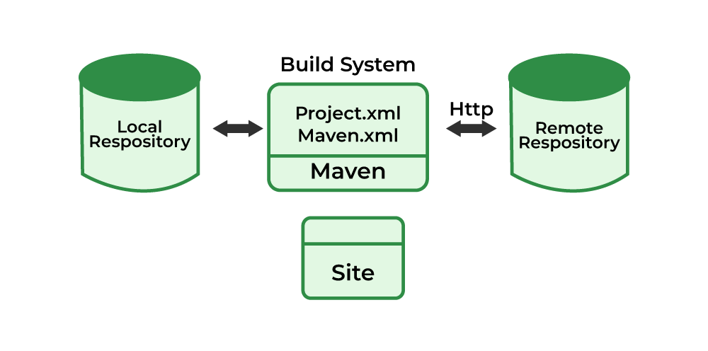

# 🚀 Apache Maven


Apache Maven is a **build automation** and **project management tool** used mainly for **Java projects**.  
It helps developers **compile, test, package, and manage dependencies** easily using one configuration file: `pom.xml`.

---

## 🧱 What is Apache Maven?
Apache Maven is a tool that **automates the entire build process**.  
It removes the need to manually download libraries or write long build scripts.

**In simple words:**  
➡️ *Maven builds your Java project and downloads everything your project needs automatically.*

---

## 🎯 Why Do We Use Maven?
- ✔ **Manages dependencies** (libraries downloaded automatically)  
- ✔ **Standard project structure** → easy for teams  
- ✔ **Automates build** (compile → test → package)  
- ✔ **Uses `pom.xml` for configuration**  
- ✔ **Works the same everywhere** (CI/CD friendly)  

---

## 📄 POM (Project Object Model)
`pom.xml` is the **heart of Maven**. 
pom.xml is the main configuration file used by Maven.
It tells Maven everything about your project and how to build it.

It contains:
- Project name, version  
- Required dependencies  
- Build plugins  
- Repositories  
- Packaging type (JAR/WAR)

### ✔ Example Dependency Block
```xml
<dependency>
  <groupId>org.springframework</groupId>
  <artifactId>spring-core</artifactId>
  <version>5.3.20</version>
</dependency>
````

➡️ Maven reads this and **automatically downloads** the correct library.

---

## 📦 Dependencies

These are **external libraries** that your project needs.
Example: Spring Boot, MySQL Connector, Gson, etc.

Maven downloads dependencies from:

* **Local Repository** → on your computer
* **Maven Central** → global public repo
* **Remote Repositories** → (optional, company repos)

---

## 🔄 Maven Build Lifecycle (Simple Explanation)

Maven follows a fixed sequence called the **build lifecycle**:

| Phase      | Simple Meaning              |
| ---------- | --------------------------- |
| `validate` | Check project correctness   |
| `compile`  | Compile Java code           |
| `test`     | Run test cases              |
| `package`  | Create JAR/WAR file         |
| `verify`   | Extra checks                |
| `install`  | Add build to local repo     |
| `deploy`   | Upload build to remote repo |

Most commonly used:

```
mvn clean package
```

---

## 🧰 Common Maven Commands

| Command       | Description                   |
| ------------- | ----------------------------- |
| `mvn compile` | Compiles Java code            |
| `mvn test`    | Runs tests                    |
| `mvn package` | Builds JAR/WAR                |
| `mvn clean`   | Deletes old build files       |
| `mvn install` | Installs output to local repo |
| `mvn deploy`  | Pushes build to remote repo   |

---

## 📁 Standard Maven Project Structure

```
project/
 ├── src/
 │    ├── main/
 │    │     ├── java/        # Java source files
 │    │     └── resources/   # Config files
 │    └── test/
 │          ├── java/        # Test code
 │          └── resources/
 └── pom.xml
```

➡️ This structure is the **same** in all Maven projects → makes things easy to understand.

### 🗂️ **1. src/main/java/**
This folder contains **your main application code**.  
All `.java` files that run your program are placed here.

---

### ⚙️ **2. src/main/resources/**
Stores **configuration files** your program needs.  
Examples:
- `application.properties`
- `log4j.properties`
- JSON/XML config files

---

### 🧪 **3. src/test/java/**
Contains **test code** written for unit testing your application.  
Example: JUnit test files.

---

### 🧾 **4. src/test/resources/**
Stores test-related config or sample data used during testing.

---

### 📄 **5. pom.xml**
This is the **heart of a Maven project**.  
It stores:
- Dependencies (libraries)
- Plugins
- Build settings
- Project information-

## 🔌 Maven Plugins

Plugins add additional features.

Common plugins:

* **Compiler Plugin** → controls Java version for compiling
* **Surefire Plugin** → runs test cases
* **Shade Plugin** → create fat JAR (single runnable JAR)

Example plugin:

```xml
<plugin>
  <groupId>org.apache.maven.plugins</groupId>
  <artifactId>maven-compiler-plugin</artifactId>
  <version>3.8.1</version>
  <configuration>
    <source>17</source>
    <target>17</target>
  </configuration>
</plugin>
```

---

## ⭐ Summary (Super Simple)

| Concept          | Meaning                                   |
| ---------------- | ----------------------------------------- |
| **Maven**        | Tool to build/manage Java projects        |
| **POM**          | XML file with project info & dependencies |
| **Dependencies** | External libraries                        |
| **Lifecycle**    | Steps Maven follows to build              |
| **Commands**     | compile, test, package, clean             |

---

# 🏗️ Maven Architecture 


---

## 🧱 1. Local Repository
The **local repository** is a folder on your computer where Maven stores all downloaded libraries.

➡️ When you build a project, Maven **first checks the local repo** to see if the required dependency already exists.

If found → Maven uses it directly (faster builds).

---

## 🌐 2. Remote Repository
If a dependency is **not found** locally, Maven downloads it from a **remote repository** like Maven Central using **HTTP**.

➡️ Remote repo = Internet storage for Java libraries.

---

## ⚙️ 3. Maven Build System
Maven uses configuration files such as:

- `pom.xml` (main file used today)
- Older formats like `project.xml` or `maven.xml` (shown in diagrams)

These files tell Maven:
- What dependencies the project needs  
- How to build, test, and package the project  

➡️ Maven reads this file and controls the entire build process.

---

## 🗂️ 4. Communication Flow
- **Maven ↔ Local Repository** → Quickly checks local storage first  
- **Maven ↔ Remote Repository** → Downloads required dependencies if missing  

---

## 📄 5. Maven Site (Optional)
Maven can generate a **project website** that includes documentation, reports, and project details.

➡️ This is optional but useful for large projects.

---

## ⭐ Summary (Very Simple)
- **Local Repo** → First place Maven checks for libraries  
- **Remote Repo** → Downloads missing libraries  
- **Maven Build System** → Reads `pom.xml` and builds your project  
- **Site** → Optional documentation output  

Maven mainly acts as a bridge between your project and these repositories to make building easier and automatic.

---
# 📦 Maven Example Code with Simple Explanation

## 🧩 Sample `pom.xml`

```xml
<project xmlns="http://maven.apache.org/POM/4.0.0"
         xmlns:xsi="http://www.w3.org/2001/XMLSchema-instance"
         xsi:schemaLocation="http://maven.apache.org/POM/4.0.0 
         http://maven.apache.org/xsd/maven-4.0.0.xsd">

    <!-- 1. Model Version -->
    <modelVersion>4.0.0</modelVersion>

    <!-- 2. Basic Project Information -->
    <groupId>com.example</groupId>
    <artifactId>maven-demo</artifactId>
    <version>1.0.0</version>
    <packaging>jar</packaging>

    <!-- 3. Project Name -->
    <name>Maven Demo Project</name>

    <!-- 4. Dependencies Section -->
    <dependencies>
        <!-- Example dependency: Gson library -->
        <dependency>
            <groupId>com.google.code.gson</groupId>
            <artifactId>gson</artifactId>
            <version>2.10.1</version>
        </dependency>
    </dependencies>

    <!-- 5. Build Section with Plugins -->
    <build>
        <plugins>

            <!-- Compiler Plugin -->
            <plugin>
                <groupId>org.apache.maven.plugins</groupId>
                <artifactId>maven-compiler-plugin</artifactId>
                <version>3.8.1</version>
                <configuration>
                    <source>17</source>
                    <target>17</target>
                </configuration>
            </plugin>

        </plugins>
    </build>

</project>
````

---

# 📝 Explanation of the Code (Simple & Beginner Friendly)

## 1️⃣ Model Version

```xml
<modelVersion>4.0.0</modelVersion>
```

* This is always **4.0.0** for modern Maven projects.
* It tells Maven which POM structure to follow.

---

## 2️⃣ Basic Project Details

```xml
<groupId>com.example</groupId>
<artifactId>maven-demo</artifactId>
<version>1.0.0</version>
<packaging>jar</packaging>
```

* **groupId** → Your organization/project base name
* **artifactId** → Your application or module name
* **version** → Version number of your build
* **packaging** → Output format (`jar`, `war`, etc.)

➡️ This is how Maven identifies and names your project output.

---

## 3️⃣ Project Name

```xml
<name>Maven Demo Project</name>
```

A readable name for your project (used in reports and logs).

---

## 4️⃣ Dependencies

```xml
<dependencies>
    <dependency>
        <groupId>com.google.code.gson</groupId>
        <artifactId>gson</artifactId>
        <version>2.10.1</version>
    </dependency>
</dependencies>
```

* Dependencies are **external libraries** your project needs.
* Example here: **Gson**, used to work with JSON.
* Maven automatically downloads this library for you.

➡️ You don’t need to manually download JAR files — Maven handles it!

---

## 5️⃣ Build Section + Plugins

```xml
<build>
    <plugins>
        <plugin>
            <groupId>org.apache.maven.plugins</groupId>
            <artifactId>maven-compiler-plugin</artifactId>
            <version>3.8.1</version>
            <configuration>
                <source>17</source>
                <target>17</target>
            </configuration>
        </plugin>
    </plugins>
</build>
```

### ✔ What this plugin does:

* Tells Maven to use **Java 17** for compiling code.
* Ensures your code follows the correct Java version.

➡️ Without this, Maven might use an older Java version.

---

## ⭐ Summary (Super Simple)

| Section          | Purpose                              |
| ---------------- | ------------------------------------ |
| **Project Info** | Identifies the project               |
| **Dependencies** | Libraries to download automatically  |
| **Plugins**      | Tools that modify the build behavior |
| **Build Config** | Controls compilation settings        |

Maven uses this file to completely automate your project's build process.

---

# 🧪 Maven CI/CD Lab using GitHub Actions

## 📌 Objective
This lab demonstrates how to:
- Create a Maven project directly on GitHub
- Add Java source code and test cases
- Configure GitHub Actions for CI/CD
- Automatically build and test the project on every push

👉 This method uses **only GitHub Web UI**  
👉 No local system setup required  
👉 Ideal for beginners and freshers

---

## 🛠 Tools Used
- GitHub
- Maven
- Java 17
- GitHub Actions
- JUnit 5

---

## 📁 Project Structure

```

maven-lab/
├── pom.xml
├── src/
│   ├── main/java/com/example/App.java
│   └── test/java/com/example/AppTest.java
└── .github/workflows/maven.yml

```

---

## 🚀 Step 1: Create GitHub Repository

1. Go to **GitHub**
2. Click **New Repository**
3. Repository name: `maven-lab`
4. ✅ Select **Add README.md**
5. Click **Create repository**

---

## 🚀 Step 2: Create `pom.xml`

1. Open your repository
2. Click **Add file → Create new file**
3. File name:
```

pom.xml

````

4. Paste the following content:

```xml
<project xmlns="http://maven.apache.org/POM/4.0.0">

    <modelVersion>4.0.0</modelVersion>
    <groupId>com.example</groupId>
    <artifactId>maven-actions-demo</artifactId>
    <version>1.0-SNAPSHOT</version>

    <properties>
        <maven.compiler.source>17</maven.compiler.source>
        <maven.compiler.target>17</maven.compiler.target>
    </properties>

    <dependencies>
        <dependency>
            <groupId>org.junit.jupiter</groupId>
            <artifactId>junit-jupiter-api</artifactId>
            <version>5.10.0</version>
            <scope>test</scope>
        </dependency>
        <dependency>
            <groupId>org.junit.jupiter</groupId>
            <artifactId>junit-jupiter-engine</artifactId>
            <version>5.10.0</version>
            <scope>test</scope>
        </dependency>
    </dependencies>

</project>
````

5. Click **Commit new file**

---

## 🚀 Step 3: Create `App.java`

1. Click **Add file → Create new file**
2. File name:

```
src/main/java/com/example/App.java
```

> GitHub automatically creates all folders.

3. Paste:

```java
package com.example;

public class App {
    public static void main(String[] args) {
        System.out.println("Hello from Maven GitHub Actions Lab!");
    }
}
```

4. Click **Commit new file**

---

## 🚀 Step 4: Create `AppTest.java`

1. Click **Add file → Create new file**
2. File name:

```
src/test/java/com/example/AppTest.java
```

3. Paste:

```java
package com.example;

import org.junit.jupiter.api.Test;
import static org.junit.jupiter.api.Assertions.assertEquals;

public class AppTest {

    @Test
    public void testOutput() {
        assertEquals("Hello from Maven GitHub Actions Lab!", getMessage());
    }

    private String getMessage() {
        return "Hello from Maven GitHub Actions Lab!";
    }
}
```

4. Click **Commit new file**

---

## 🚀 Step 5: Create GitHub Actions Workflow

1. Click **Add file → Create new file**
2. File name:

```
.github/workflows/maven.yml
```

3. Paste:

```yaml
name: Maven CI

on:
  push:
    branches: [ "main" ]

jobs:
  build:
    runs-on: ubuntu-latest

    steps:
    - uses: actions/checkout@v4

    - uses: actions/setup-java@v4
      with:
        distribution: temurin
        java-version: 17

    - name: Build
      run: mvn package

    - name: Test
      run: mvn test
```

4. Click **Commit new file**

---

## 📊 Step 6: View CI/CD Pipeline Output

1. Go to **Actions** tab in your repository
2. Click the latest workflow run
3. Verify:

   * Build step passed
   * Test step passed
   * Green check mark ✅

---

## 🧠 Explanation (Simple Words)

* GitHub detects the workflow file
* Creates a virtual Linux machine
* Installs Java and Maven
* Runs:

  ```
  mvn package
  mvn test
  ```
* Shows results in Actions tab

This is **Continuous Integration (CI)**.

---

## ✅ Result

✔ Maven project built successfully
✔ Unit tests executed
✔ CI/CD pipeline completed

---

## 🎯 Conclusion

This lab demonstrates a simple and effective way to implement CI/CD for a Java Maven project using GitHub Actions without any local setup. It is suitable for beginners and freshers learning DevOps fundamentals.

---


